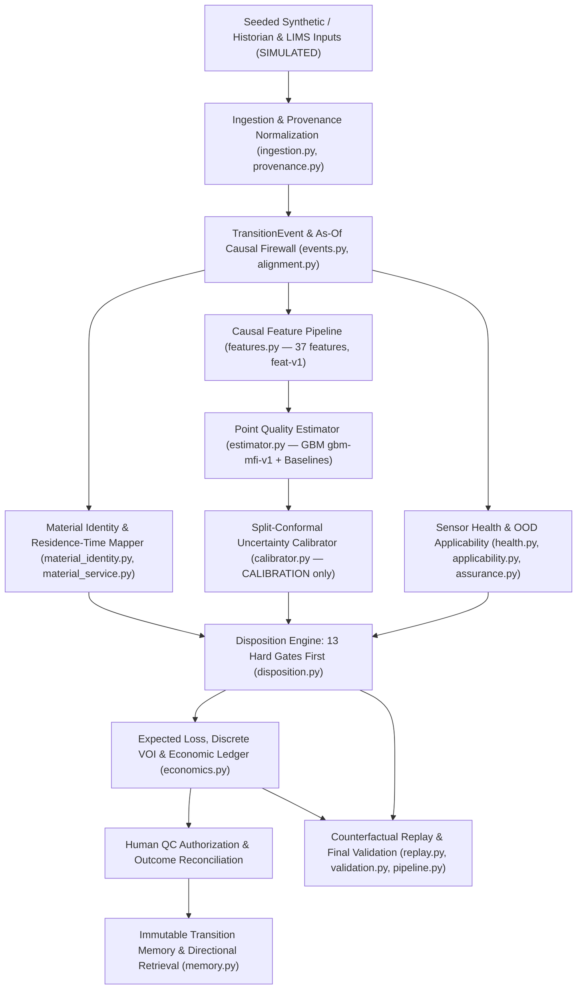

# PROJECT_HANDOFF — GradeShift PrimePath

> **DO NOT RESTART THE PROJECT.**
> **This repository already contains the completed PrimePath domain stack through final validation. Inspect before modifying.**

---

## Checkpoint Metadata

- **Project:** GradeShift PrimePath
- **Current Checkpoint:** Phase 13 — Final Validation Complete
- **GitHub Repository URL:** `https://github.com/Ayush-Sharma99/Gradeshift_AI.git`
- **Checkpoint Branch:** `primepath-phase13-complete`
- **Checkpoint Tag:** `v0.13.0-phase13-complete`
- **Baseline Commit SHA:** `9e6e394156e102e0a0a5a0fef51352daf6155b0c` (`9e6e394`)

---

## A. Product Definition

**GradeShift PrimePath** is **an uncertainty-aware, human-authorized commercial-disposition decision layer for polyolefin grade transitions**.

- **Tagline:** *Know when it is a prime-release candidate. Prove why. Learn every transition.*
- **Primary Decision:** At any decision timestamp $t$ during a grade transition (e.g., Grade A $\to$ Grade B), PrimePath evaluates the material window currently moving toward downstream routing and recommends one of four actions:
  1. **`HOLD` (`HOLD / FOLLOW CURRENT ROUTING`)**
  2. **`SAMPLE_NOW` (`SAMPLE NOW`)**
  3. **`PRIME_RELEASE_CANDIDATE` (`PRIME-RELEASE CANDIDATE`)**
  4. **`ABSTAIN` (`ABSTAIN / FOLLOW SOP`, with `FOLLOW_SOP` fallback on expiry)**
- **Primary Users:** Board/shift operator and Shift Quality Approver (QC), supported by process engineers and plant management.

---

## B. Industrial Problem

In continuous polyolefin manufacturing (such as gas-phase fluidized-bed polyethylene or polypropylene lines), reactors switch sequentially between polymer grades with different Melt Flow Index ($\text{MFI}$) and density specifications:

1. **Large Bed Inventory & Residence-Time Washout:** Reactor beds hold tens of tonnes of polymer with mean residence times $\tau \approx 2\text{–}4.5\text{ hours}$ (`150 min` in the baseline CSTR/Erlang parameterization). During a transition, exponential washout produces intermediate material.
2. **The Laboratory Blind Window (`35–75 min`):** ASTM D1238 laboratory MFI measurements require manual sampling, transport, preparation, and extrusion. Because quality truth arrives late (`60 min` nominal lab delay in simulation; `45 min` confirmatory sample latency in policy), operators cannot tell in real time when transitional polymer has genuinely entered target specification and satisfied dwell.
3. **Asymmetric Commercial Consequence:**
   - Routing off-spec material to a prime silo (**false-prime exposure**) risks contaminating prime inventory and incurring severe commercial penalties (`₹40,000–90,000/t` assumed penalty).
   - Continuing to route on-spec material to downgrade/wide-spec silos while waiting for delayed laboratory confirmation (**false-hold opportunity loss**) sacrifices the prime-over-downgrade margin spread (`₹12,000–25,000/t` assumed spread across `LOW`/`BASE`/`HIGH` scenarios).

---

## C. Exact Product White Space

Commercial industrial vendors (AspenTech, Yokogawa, Siemens, AVEVA, Imubit, Seeq) already provide nonlinear APC, inferential soft sensors, grade-change trajectory control, and process analytics.

PrimePath does **not** compete as "another APC controller" or "a naked soft sensor." Its exact white space is the **auditable commercial-disposition decision layer** that sits above plant automation and connects:

$$\text{Process Trajectory} + \text{Delayed Lab Truth} + \text{Calibrated Uncertainty} + \text{Material Identity (Residence-Time Window)} + \text{Hard Assurance Gates} + \text{Asymmetric Expected Loss \& VOI} + \text{Human QC Authorization} + \text{Reconciled Transition Memory}$$

Point predictions alone never trigger a prime release candidate; interval bounds, dwell, material mapping support, sensor health, and domain applicability directly govern what actions are permissible.

---

## D. Non-Product Boundaries

PrimePath is strictly **advisory and read-only**. It does **NOT**:
- certify product quality or issue commercial release certificates;
- replace laboratory quality authority (LIMS / QC sign-off);
- replace DCS, APC, or Safety Instrumented Systems (SIS);
- write reactor setpoints ($H_2/\text{monomer}$ ratio, temperature, pressure, catalyst feed);
- actuate plant equipment, valves, or silo diverters;
- claim process-safety certification or autonomous control;
- perform silent online learning or automatic model retraining from operational episodes.

---

## E. Architecture

### Dependency Rule

$$\texttt{Streamlit UI} \longrightarrow \texttt{src/gradeshift/ services} \longrightarrow \texttt{src/gradeshift/schemas.py \& config.py}$$

Domain modules in `src/gradeshift/` must **never** import `streamlit` (enforced by [`tests/test_architecture.py`](tests/test_architecture.py)).

### Decision Lineage



### Actual Repository Structure

```text
GradeShift/
├── README.md                                          # Project overview, setup, test/launch/validation guide
├── AGENTS.md                                          # Concise operational rules for coding agents
├── PROJECT_HANDOFF.md                                 # Durable engineering handoff (this document)
├── GradeShift_Product_Freeze_Engineering_Handoff.md   # Authoritative product freeze & domain specification
├── pyproject.toml                                     # Reproducible Python package & pytest configuration
├── requirements.txt                                   # Pinned/bounded runtime & test dependencies
├── LICENSE                                            # MIT License
├── .gitignore                                         # Secret, cache, OS, and temp file exclusions
├── .gitattributes                                     # Line-ending and binary file attributes
├── conftest.py                                        # Pytest path bootstrap for src/gradeshift
├── gs_theme.py                                        # Reusable Streamlit design system & Plotly theme
├── gradeshift_ai.png                                  # Brand asset used by gs_theme.py
├── app.py                                             # Current Streamlit entry point (legacy UI awaiting Phase 14 refactor)
├── pages/                                             # Current Streamlit multipage views (1..6, awaiting Phase 14 refactor)
├── src/
│   └── gradeshift/                                    # Completed Phase 1–13 PrimePath domain package (21 modules)
├── tests/                                             # Complete test suite (20 test files, 266 passing tests)
├── artifacts/
│   ├── final_validation.json                          # Primary Phase-13 final validation JSON output
│   ├── phase9_report.json                             # Phase-9 disposition report
│   ├── manifests/                                     # Frozen validation & dataset manifests
│   ├── phase5/                                        # GBM model (.joblib), manifest.json, metrics.json
│   ├── phase6/                                        # Conformal calibrators (.joblib) & phase6_metrics.json
│   ├── phase7/                                        # OOD applicability detector (.joblib) & phase7_report.json
│   ├── phase8/                                        # Material identity resolution report (phase8_report.json)
│   ├── phase9/                                        # Disposition engine report copy (phase9_report.json)
│   ├── phase10/                                       # Economic ledger & VOI report (phase10_report.json)
│   ├── phase11/                                       # Transition memory & analog retrieval report (phase11_report.json)
│   ├── phase12/                                       # Counterfactual replay report (phase12_report.json)
│   └── final_validation/                              # Final validation JSON copy
├── docs/                                              # Complete engineering, validation, card, and governance docs
├── scripts/                                           # PowerShell, Bash, and Python CLI entry points
├── experiments/                                       # Non-core control counterfactuals (legacy_control_counterfactual.py)
├── competition/                                       # Placeholder for Phase 16–17 presentation/demo assets
└── historical/                                        # Preserved historical submission PDF, audit, and legacy code snapshot
```

---

## F. Completed Capability Inventory (`src/gradeshift/`)

| Phase | Capability | Module(s) | Test Module(s) | Status |
|---:|---|---|---|---|
| **1** | Central config (`GRADES`, `ECON_SCENARIOS`, `POLICY`) & typed UTC-validated schemas with `Provenance` | `config.py`, `schemas.py`, `provenance.py` | `test_config.py`, `test_schemas.py` | ✅ Complete |
| **2** | Seeded synthetic CSTR/Erlang generator (steady state == target MFI; fixes legacy defect D1) & ingestion | `simulate.py`, `ingestion.py` | `test_simulate.py`, `test_ingestion.py` | ✅ Complete |
| **3** | `TransitionEvent` construction (`collected_at` vs `result_at`), `as_of` temporal firewall, chronological whole-event partitions | `events.py`, `alignment.py`, `partition.py`, `dataset.py` | `test_events.py`, `test_alignment.py`, `test_partition.py` | ✅ Complete |
| **4** | Residence-time distribution (CSTR/Erlang) & downstream mass integration | `material_identity.py` | `test_material_identity.py` | ✅ Complete |
| **5** | Causal feature pipeline (`37` features, `feat-v1`), baselines (`last_lab`, `deterministic_online`, `linear_process`), & `GBMQualityEstimator` (`gbm-mfi-v1`) | `features.py`, `estimator.py`, `pipeline.py` | `test_features.py`, `test_estimator.py` | ✅ Complete |
| **6** | Split-conformal uncertainty calibration (`split-conformal-v1`, fitted on `CALIBRATION` only, support-gated) | `calibrator.py`, `pipeline.py` | `test_calibrator.py` | ✅ Complete |
| **7** | Sensor health rules (`missing`, `stale`, `frozen`, `range`, `rate`, `disorder`, `gap`), fault injection, train-only `ApplicabilityDetector` (OOD), & `AssuranceResult` | `health.py`, `faults.py`, `applicability.py`, `assurance.py` | `test_health.py`, `test_applicability.py`, `test_assurance.py` | ✅ Complete |
| **8** | Operational material service (`resolve_material_window`, `MaterialEligibilityResult`, `MaterialQualityLineage`, mass reconciliation) | `material_service.py`, `pipeline.py` | `test_material_service.py` | ✅ Complete |
| **9** | Pure disposition decision engine (`evaluate_disposition`, 13 hard gates evaluated FIRST, reason codes, expiry, fallback) | `disposition.py`, `pipeline.py` | `test_disposition.py` | ✅ Complete |
| **10** | Expected loss over permitted actions, discrete-outcome VOI (`compute_voi`), episode economic ledger (`LOW`/`BASE`/`HIGH`), realized vs counterfactual split, annual scenario scale-up | `economics.py`, `pipeline.py` | `test_economics.py` | ✅ Complete |
| **11** | Immutable `TransitionMemoryStore`, post-truth reconciliation, directional & partition-isolated analog retrieval (`retrieve_transition_memory`) | `memory.py`, `pipeline.py` | `test_memory.py` | ✅ Complete |
| **12** | Counterfactual replay engine (`SOP_FIXTURE`, `POINT_THRESHOLD`, `PRIMEPATH`, `ORACLE_DIAGNOSTIC_ONLY`) under strict future-truth firewall + separate `demo_fixture` | `replay.py`, `pipeline.py` | `test_replay.py` | ✅ Complete |
| **13** | Final validation package (locked metrics, abstention decomposition, robustness matrix, diagnostic sensitivity, economic sanity, determinism check, evidence ladder, claim ledger) | `validation.py`, `pipeline.py` | `test_final_validation.py`, `test_architecture.py` | ✅ Complete |

---

## G. Important Artifacts

1. **`artifacts/final_validation.json` & `docs/FINAL_VALIDATION_REPORT.md`:**
   - Complete machine-readable and human-readable Phase-13 validation output.
   - Reproducibility fingerprints:
     - `manifest`: `manifest:5abc0eb1ad93f56c`
     - `calibrator`: `calib:3cf275c76727911a`
     - `policy`: `policy:a2555a4d9431c288`
     - `economics`: `econ:6cbd173e21b7b79a`
     - Replay determinism: `13acf6841c4621b6 == 13acf6841c4621b6` (`identical = true`)
2. **`artifacts/phase5/gbm_mfi.joblib`, `manifest.json`, `metrics.json`:**
   - Trained `GBMQualityEstimator` (`gbm-mfi-v1`, seed `42`), feature schema (`37` features), and point-prediction evaluation across `CALIBRATION` and `LOCKED_TEST`.
3. **`artifacts/phase6/calibrator_gbm.joblib`, `calibrator_linear_process.joblib`, `phase6_metrics.json`:**
   - Frozen `SplitConformalCalibrator` instances (`split-conformal-v1:marginal_symmetric`, nominal coverage `0.90`, half-width `0.2369` g/10min for GBM).
4. **`artifacts/phase7/applicability_detector.joblib` & `phase7_report.json`:**
   - Frozen train-only `ApplicabilityDetector` (`applicability-v1`) and fault/OOD verification tables.
5. **`artifacts/phase8/phase8_report.json` .. `artifacts/phase12/phase12_report.json`:**
   - Phase-by-phase JSON evidence packages for material identity, disposition scenarios, economics/VOI, transition memory, and counterfactual replay.

---

## H. Validation Methodology

1. **Whole-Event Chronological Partitioning (`18` synthetic events, `3` per direction across `6` directions):**
   - `TRAIN` (`10` earliest events, `470` labeled rows): `EP-AB-00..02`, `EP-AC-00..02`, `EP-BA-00..02`, `EP-CA-00`
   - `CALIBRATION` (`3` middle events, `141` labeled rows): `EP-BC-00`, `EP-CA-01`, `EP-CA-02`
   - `LOCKED_TEST` (`5` latest events, `235` labeled rows): `EP-BC-01`, `EP-BC-02`, `EP-CB-00`, `EP-CB-01`, `EP-CB-02`
2. **Strict Anti-Leakage & Causal Firewall:**
   - No `event_id` spans multiple partitions.
   - `as_of(event, t)` truncates all observations, routing intervals, and laboratory results with timestamps $> t$ (`result_at <= t` vs `collected_at <= t`).
   - `GBMQualityEstimator` and `ApplicabilityDetector` fit on `TRAIN` only.
   - `SplitConformalCalibrator` fits and selects its method on `CALIBRATION` only.
   - `TransitionMemoryStore` analog retrieval enforces `allowed_partition=Partition.TRAIN`, self-exclusion, and directional matching (`A->B` never retrieves `B->A`).
3. **Pass/Fail Acceptance Criteria:**
   -Evaluated on structural soundness (`no_leakage`, `deterministic_replay`, `correct_hard_gate_behavior`, `uncertainty_reported_honestly`, `economic_accounting_reconciles`, `counterfactual_realized_separated`, `every_claim_traceable`, `limitations_exposed`, `decision_behavior_understandable`, `no_unsupported_hmel_claim`), **not** vanity metric chasing.

---

## I. Current Validation Findings

### 1. Level A — Quality Estimation & Uncertainty (`LOCKED_TEST`, `235` rows across `5` events)
- **Point Estimator (`gbm-mfi-v1`):** `MAE = 0.2720 g/10min`, `RMSE = 0.4353 g/10min`, `bias = -0.2337 g/10min` (vs `LastLabBaseline` `MAE = 1.6525 g/10min`).
- **Calibrated Uncertainty (`split-conformal-v1:marginal_symmetric`):**
  - Nominal coverage: `0.90`
  - Calibration coverage: `0.9078` (`141` rows from `3` independent calibration events)
  - Locked empirical coverage: `0.6596` (`235` rows from `5` locked events), mean interval width `0.4737 g/10min` (`±0.2369 g/10min`).
  - **Honest statistical note:** `141` calibration rows come from only `3` independent transition episodes (`EP-BC-00`, `EP-CA-01`, `EP-CA-02`), so within-episode residuals are temporally correlated and shift across unseen transition directions.

### 2. Level B & C — Counterfactual Decision & Economic Replay (`LOCKED_TEST`, `BASE` Scenario)

| Policy | Mean Time to Candidate (min) | False-Prime Mass (t) | False-Hold Mass (t) | Abstention Rate | False-Prime Exposure (₹) | False-Hold Opportunity (₹) | Gross Avoidable Loss (₹) |
|---|---:|---:|---:|---:|---:|---:|---:|
| `SOP_FIXTURE` | `160.0` | `1,356.0` | `0.0` | `0.00` | `8,13,60,000` | `0` | `8,29,20,000` |
| `POINT_THRESHOLD` | `416.0` | `588.0` | `0.0` | `0.00` | `3,52,80,000` | `0` | `3,63,28,000` |
| **`PRIMEPATH`** | `None` | **`0.0`** | `984.0` | **`1.00`** | **`0`** | `1,96,80,000` | `1,96,80,000` |
| `ORACLE_DIAGNOSTIC_ONLY` | `612.0` | `0.0` | `0.0` | `0.00` | `0` | `0` | `6,56,000` |

### 3. Abstention Decomposition & Zero-Candidate Diagnostic
- On `LOCKED_TEST`, PrimePath abstained on `235 / 235` decision points (`locked_prime_candidates = 0`).
- **Why:** Chronological whole-event splitting placed `B->C` and `C->B` transitions in `LOCKED_TEST`, while `TRAIN` contained only `A->B`, `A->C`, `B->A`, and `C->A`. Because `ApplicabilityDetector` was strictly fitted on `TRAIN` only, it flagged `B->C` and `C->B` as `UNSUPPORTED` (`ood` gate blocked `235` decisions; `material_mapping` also blocked `40` early-window decisions).
- **Why this is a strength, not a bug:** Instead of issuing uncalibrated recommendations on transition directions never seen in training, PrimePath refused (`ABSTAIN / FOLLOW SOP`) and incurred **zero false-prime mass (`0.0 t`)**, whereas naive `SOP_FIXTURE` and `POINT_THRESHOLD` policies released `1,356 t` and `588 t` of off-spec polymer respectively.
- **Separate Illustrative Demo (`replay.demo_fixture`):** Demonstrates the full in-domain `A->B` decision lifecycle (`T1: HOLD` → `T2: SAMPLE_NOW` → `T3: PRIME_RELEASE_CANDIDATE`) and a frozen-sensor fault branch (`T4: ABSTAIN`). Kept strictly separate from `LOCKED_TEST`.

### 4. Robustness Matrix (`11 / 11` Scenarios Match)
- `normal_evidence` $\to$ `PRIME_RELEASE_CANDIDATE`
- `missing_sensor`, `frozen_sensor`, `stale_data`, `timestamp_disorder`, `ood_shift`, `unknown_grade_pair`, `ambiguous_routing`, `incomplete_material_mapping`, `unavailable_calibration` $\to$ `ABSTAIN`
- `expired_recommendation` $\to$ `FOLLOW_SOP`

---

## J. Remaining Work (Phase 14–17 Roadmap)

1. **Phase 14 — UI Presenter Layer & Core Views:**
   - Implement `src/gradeshift/ui/` presenter helpers wrapping frozen artifacts and `src/gradeshift/` services.
   - Refactor `app.py` into the **PrimePath Decision Cockpit**.
   - Refactor `pages/1..4` into **Transition Replay**, **Quality Evidence**, **Disposition Workbench**, and **Transition Guardian**.
2. **Phase 15 — Economics & Memory/Assurance Views:**
   - Refactor `pages/5_Economics.py` into the **Episode Economic Ledger** (`LOW`/`BASE`/`HIGH` scenarios, realized vs counterfactual split, interactive scale-up formula).
   - Refactor `pages/6_Digital_Twin.py` into **Transition Memory & Model Assurance** (3-analog directional retrieval, abstention decomposition, locked validation summary, claim ledger).
3. **Phase 16 — One-Command Demo & UI Smoke Tests:**
   - Wire one-command demo mode switching cleanly between **Illustrative Demo (`A->B` walkthrough + fault `ABSTAIN` branch)** and **Locked Validation Audit (`LOCKED_TEST`)** with prominent provenance banners.
4. **Phase 17 — Competition Presentation & Jury Package:**
   - Finalize slide-by-slide reconciliation materials and screenshot checklists in `competition/`.

---

## K. Known Limitations

1. **Synthetic Data Ceiling (`E2`/`E3`):** All observations, analyzer signals, and laboratory results are generated by `src/gradeshift/simulate.py`.
2. **Small Independent Calibration Sample (`3` events):** Conformal intervals are calibrated on `141` rows from `3` events; empirical locked coverage (`0.6596`) drops below nominal (`0.90`) due to within-episode correlation and directional shift.
3. **Unseen Locked Directions (`B->C`, `C->B`):** Chronological whole-event splitting leaves `B->C` and `C->B` out of `TRAIN`, causing 100% gate-justified abstention on `LOCKED_TEST`.
4. **Single Analyte (`MFI`):** Only Melt Flow Index (`g/10min`) is modeled dynamically in the POC; density is static grade metadata.
5. **Provisional Risk Proxy (`prob_bad`):** Candidacy is governed by whether the two-sided conformal interval lies inside `[spec_low, spec_high]`; `prob_bad` is labeled a provisional/illustrative proxy for expected-loss weighting, not a calibrated tail probability.

---

## L. Evidence Levels (`E0`–`E5`)

| Level | Category | Definition | Permitted in Repository? |
|---|---|---|---|
| **`E0`** | `ASSUMPTION` | Explicit economic, latency, or scale-up parameter assumption | ✅ Yes (must be labeled `ASSUMPTION` / `ILLUSTRATIVE`) |
| **`E1`** | `THEORY / FORMULATION` | Architectural rule, causal firewall, or advisory authority boundary | ✅ Yes |
| **`E2`** | `SYNTHETIC SIMULATION` | Metric computed on the seeded synthetic corpus (`TRAIN` / `CALIBRATION` / `LOCKED_TEST`) | ✅ Yes (must be labeled `SIMULATED`) |
| **`E3`** | `CONTROLLED PROTOTYPE` | Deterministic software verification on controlled fault/OOD/VOI fixtures | ✅ Yes (must be labeled `SIMULATED` / `ILLUSTRATIVE`) |
| **`E4`** | `HISTORICAL / PUBLIC DATA` | Replay on real historical plant or public industrial logs | ❌ Not present in repository |
| **`E5`** | `INDUSTRIAL VALIDATION` | Live plant trial or verified operational deployment at HMEL | ❌ Not present in repository |

---

## M. Claim Restrictions

Every quantitative or architectural statement in UI text, documentation, and presentations must obey [`docs/CLAIMS.md`](docs/CLAIMS.md):
- **Never** claim HMEL plant validation, live plant deployment, or verified HMEL savings (`₹60–102 Cr/yr` or `₹81 Cr/yr` as measured fact).
- **Never** claim autonomous control, RL/CQL optimization, NMPC/CBF safety guarantees, or AI product certification as current product behavior.
- **Always** label synthetic replay numbers `SIMULATED` and economic scenarios `ASSUMPTION` / `ILLUSTRATIVE`.
- **Always** keep `LOCKED_VALIDATION` metrics separate from `ILLUSTRATIVE_DEMO` fixtures.

---

## N. Expected Future Workflow for Coding Agents

When picking up development from this checkpoint:
1. **Verify Baseline First:** Run `python -m pytest` (or `.\scripts\test.ps1`) and confirm all 266 tests pass.
2. **Create a Feature Branch:** Branch off `primepath-phase13-complete` (e.g., `git checkout -b feat/phase14-primepath-ui`). Keep `primepath-phase13-complete` and tag `v0.13.0-phase13-complete` untouched as the immutable Phase-13 baseline.
3. **Build `src/gradeshift/ui/` First:** Create presenter modules that call `src/gradeshift/` functions (`pipeline.py`, `replay.py`, `disposition.py`, `economics.py`, `memory.py`, `validation.py`) and read `artifacts/final_validation.json`.
4. **Refactor `app.py` and `pages/1..6`:** Use `gs_theme.py` components; ensure every displayed number traces to a computed PrimePath object or artifact; display clear `SIMULATED` / `ASSUMPTION` / `LOCKED_VALIDATION` vs `ILLUSTRATIVE_DEMO` badges.
5. **Enforce Architecture & Claim Tests:** Add UI smoke tests (`streamlit.testing.v1.AppTest`) and ensure `tests/test_architecture.py` and `tests/test_final_validation.py` continue to pass without modification to validation gates.
