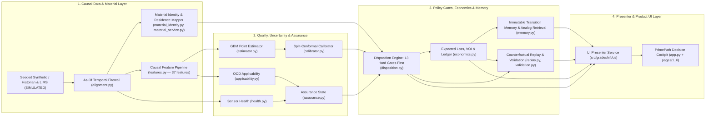

# GradeShift PrimePath

> **An uncertainty-aware, human-authorized commercial-disposition decision layer for polyolefin grade transitions.**  
> *Know when it is a prime-release candidate. Prove why. Learn every transition.*

[](docs/FINAL_TECHNICAL_STATUS.md)
[-1769E0)](docs/CLAIMS_AND_EVIDENCE.md)
[](tests/)

> [!IMPORTANT]
> **Evidence & Authority Notice:** All datasets, predictions, counterfactual replays, and economic ledgers in this repository are **synthetic (`E2`) or controlled prototype (`E3`) results (`SIMULATED` / `ASSUMPTION`)**. No HMEL plant data was used, and no HMEL savings or field performance are claimed as measured. PrimePath is strictly **read-only and advisory**—every `PRIME-RELEASE CANDIDATE` recommendation requires human Quality Control (`Shift Quality Approver (QC)`) authorization under plant SOP.

---

## 1. Project Overview

**GradeShift PrimePath** addresses a high-consequence operational decision during continuous polyolefin reactor grade transitions: **determining when transitional polymer moving toward downstream silos is a defensible candidate for prime commercial disposition, when another laboratory sample has positive economic value, when to keep holding in downgrade/wide-spec routing, and when to abstain.**

This repository represents the **Competition-Ready Release (`v0.17.0-competition-ready`)** built on top of the frozen **Phase-13 Final Validation Checkpoint (`v0.13.0-phase13-complete`)**. See [`docs/COMPETITION_READINESS.md`](docs/COMPETITION_READINESS.md), [`docs/JURY_DEMO_SCRIPT.md`](docs/JURY_DEMO_SCRIPT.md), [`docs/CLAIMS_AND_EVIDENCE.md`](docs/CLAIMS_AND_EVIDENCE.md), [`docs/KNOWN_LIMITATIONS.md`](docs/KNOWN_LIMITATIONS.md), and [`docs/FINAL_TECHNICAL_STATUS.md`](docs/FINAL_TECHNICAL_STATUS.md).

---

## 2. PrimePath Definition

PrimePath is a vendor-neutral, read-only **commercial-disposition decision support layer** sitting above reactor automation (DCS/APC) and alongside laboratory information management (LIMS).

Rather than outputting a naked point prediction (`MFI = 7.9 g/10min`), PrimePath evaluates a 13-gate operational policy over time-aligned process, residence-time material mapping, calibrated conformal intervals, sensor health, and out-of-domain (OOD) applicability to recommend one of four actions:

| Action | Meaning |
|---|---|
| **`HOLD` (`HOLD / FOLLOW CURRENT ROUTING`)** | Maintain current downgrade/wide-spec routing because target specification, calibrated 90% interval bounds, or required dwell (`30 min`) are not yet satisfied and confirmatory sampling is unavailable or not justified. |
| **`SAMPLE_NOW` (`SAMPLE NOW`)** | Request an immediate confirmatory laboratory sample because the calibrated interval crosses a specification limit, a lab result can arrive within the decision horizon (`45 min` latency vs `240 min` horizon), and Value of Information ($\text{VOI}$) exceeds threshold. |
| **`PRIME_RELEASE_CANDIDATE` (`PRIME-RELEASE CANDIDATE`)** | Flag the mapped downstream material window as eligible for human QC review and prime disposition because all 13 hard policy gates pass, the entire 90% interval lies within target specification limits, and dwell is satisfied. |
| **`ABSTAIN` (`ABSTAIN / FOLLOW SOP`)** | Refuse to issue an active recommendation whenever any hard gate fails (sensor fault, OOD/unsupported grade pair, ambiguous or unsupported material window mapping, missing calibration, or timestamp disorder). Expired recommendations trigger `FOLLOW_SOP`. |

---

## 3. Problem Being Solved

During sequential grade changes in continuous polyolefin reactors (e.g., switching from Grade A `HDPE Pipe, MFI 0.3` to Grade B `HDPE Blow Moulding, MFI 8.0`):

1. **Residence-Time Washout:** Large reactor bed inventories (`~2.5 h` mean residence time $\tau = 150\text{ min}$) wash out exponentially, producing transitional polymer over several hours.
2. **The Laboratory Blind Window (`35–75 min`):** Laboratory ASTM D1238 Melt Flow Index (`MFI`) tests arrive with substantial delay (`collected_at` vs `result_at`). By the time a lab result confirms quality, tens of tonnes of polymer have already moved downstream.
3. **Asymmetric Disposition Risk:**
   - **Premature switching (False-Prime Exposure):** Routing off-spec polymer into a prime silo contaminates prime inventory (`₹40,000–90,000/t` assumed penalty).
   - **Excessive waiting (False-Hold Opportunity Loss):** Routing already on-spec polymer to downgrade silos while waiting for delayed lab truth forfeits the prime-over-downgrade margin spread (`₹12,000–25,000/t` assumed spread).

---

## 4. Core Workflow

At each decision timestamp $t$ during an active transition episode:

1. **Causal As-Of Alignment:** Truncate all process tags, routing intervals, and laboratory records at timestamp $t$ (`result_at <= t`), enforcing a strict temporal firewall against future truth leakage.
2. **Material Identity Resolution:** Map the decision timestamp $t$ through CSTR/Erlang residence-time and transport delay models to identify the exact downstream material production window, mass (`tonnes`), route shares, and mapping support (`WELL_SUPPORTED`, `PARTIALLY_SUPPORTED`, `AMBIGUOUS`, `UNAVAILABLE`).
3. **Quality Estimation & Calibrated Uncertainty:** Compute causal lag/rolling/slope features (`37` features, `feat-v1`), predict point `MFI` via the train-fitted `GBMQualityEstimator` (`gbm-mfi-v1`), and construct a 90% prediction interval via the calibration-fitted `SplitConformalCalibrator` (`split-conformal-v1`).
4. **Sensor Health & Applicability Assurance:** Evaluate online analyzer/process tag health (`NORMAL`, `DEGRADED`, `ABNORMAL`, `UNAVAILABLE`) and train-only domain support (`NORMAL`, `LOW_SUPPORT`, `OOD`, `UNSUPPORTED`).
5. **13 Hard Policy Gates First:** Evaluate all 13 blocking gates (`disposition.py`). Any gate failure forces `ABSTAIN / FOLLOW SOP` regardless of expected economic value.
6. **Expected Loss & Discrete VOI:** Over permitted actions only, compute expected loss ($\text{EL}$) and discrete-outcome Value of Information ($\text{VOI}$) under explicit economic scenarios (`LOW`, `BASE`, `HIGH`).
7. **Human Authorization & Outcome Reconciliation:** Record required QC approver role (`Shift Quality Approver (QC)`), recommendation expiry (`30 min`), and—once delayed lab truth arrives post-decision—reconcile realized vs counterfactual value into an immutable `TransitionMemoryStore`.

---

## 5. Architecture



---

## 6. Repository Structure

```text
GradeShift/
├── README.md                                          # Project documentation (this file)
├── AGENTS.md                                          # Operational rules and handoff for coding agents
├── PROJECT_HANDOFF.md                                 # Comprehensive engineering handoff
├── GradeShift_Product_Freeze_Engineering_Handoff.md   # Authoritative product freeze specification
├── pyproject.toml                                     # Package metadata & pytest configuration
├── requirements.txt                                   # Python dependencies
├── LICENSE                                            # MIT License
├── .gitignore                                         # Git ignore rules & secret hygiene
├── .gitattributes                                     # Line-ending & binary file rules
├── conftest.py                                        # Pytest sys.path bootstrap for src/
├── gs_theme.py                                        # PrimePath Streamlit & Plotly design system
├── gradeshift_ai.png                                  # Brand logo asset
├── app.py                                             # PrimePath Decision Cockpit (main entry point)
├── pages/                                             # PrimePath multipage views (1..6)
│   ├── 1_Grade_Transition.py                          # Transition Replay & Counterfactual Comparison
│   ├── 2_Soft_Sensor.py                               # Quality Evidence & Conformal Calibration
│   ├── 3_AI_Optimizer.py                              # Disposition Workbench & Policy Gate Audit
│   ├── 4_Safety.py                                    # Transition Guardian (Health, Faults & OOD)
│   ├── 5_Economics.py                                 # Economic Ledger, VOI & Scenario Scale-Up
│   └── 6_Digital_Twin.py                              # Transition Memory & Model Assurance
├── src/
│   └── gradeshift/                                    # PrimePath domain engine (21 modules) + ui/ presenter package
├── tests/                                             # Pytest test suite (22 modules, 295 tests)
├── artifacts/                                         # Frozen Phase 5–13 artifacts, manifests, and models
├── docs/                                              # Product contract, architecture, validation, jury script, claims
├── scripts/                                           # CLI scripts for tests, validation, demo, and app launch
├── experiments/                                       # Non-core control counterfactuals
└── historical/                                        # Preserved initial submission PDF, audit, and legacy files
```

---

## 7. Setup

### Prerequisites
- **Python:** `3.10+` (validated on Python `3.10.0`)
- **OS:** Windows, Linux, or macOS (CPU-only; no GPU required)

### Installation

```powershell
python -m venv .venv
.\.venv\Scripts\Activate.ps1
python -m pip install -r requirements.txt
```

---

## 8. Test Command

Run the complete 295-test suite:

```powershell
# PowerShell (Windows)
.\scripts\test.ps1

# Or directly via pytest:
python -m pytest -v
```

```bash
# Bash (Linux / macOS / Git Bash)
bash scripts/test.sh
```

- **Verified Test Count:** `295 passed` across `22` test modules (`0` failures).
- **Fast Unit + UI + Smoke Subset (~30 seconds):**
  ```powershell
  python -m pytest -k "not test_final_validation and not test_calibration_reproducible and not test_reproducible_pipeline"
  ```

---

## 9. Application Launch Command

```powershell
# PowerShell (Windows)
.\scripts\run_app.ps1

# Or directly:
python -m streamlit run app.py
```

```bash
# Bash
bash scripts/run_app.sh
```

---

## 10. Demo Instructions (3–5 Minute Competition Walkthrough)

Run the one-command competition demo verification (`T1_HOLD` $\to$ `T2_SAMPLE_NOW` $\to$ `T3_PRIME_CANDIDATE` $\to$ `T4_TRUTH_RECONCILED` $\to$ `T5_ECONOMIC_LEDGER` $\to$ `T6_FAULT_ABSTAIN`, plus Locked Validation summary and fingerprint verification):

```powershell
.\scripts\demo.ps1
# Or directly:
python scripts/demo.py
```

See [`docs/JURY_DEMO_SCRIPT.md`](docs/JURY_DEMO_SCRIPT.md) for the complete 30-second, 90-second, 3-minute, and 5-minute jury scripts and Q&A defense.

---

## 11. Validation Instructions

To verify or regenerate the frozen Phase-13 validation suite (`artifacts/final_validation.json` and `docs/FINAL_VALIDATION_REPORT.md`):

```powershell
# Verify existing frozen artifacts and fingerprints (fast check)
python scripts/validate.py --verify-only

# Regenerate Phase-13 validation artifacts from scratch (~2 minutes)
.\scripts\validate.ps1 -Regenerate
```

---

## 12. Evidence Levels

Every claim and metric in this repository is tagged with a formal evidence level ([`docs/CLAIMS_AND_EVIDENCE.md`](docs/CLAIMS_AND_EVIDENCE.md)):

- **`E0` (`ASSUMPTION`):** Explicit scenario parameters (prices, penalties, sample costs, annual transition counts).
- **`E1` (`THEORY / FORMULATION`):** Causal firewall structure, residence-time formulation, and human-authorized governance design.
- **`E2` (`SYNTHETIC SIMULATION`):** Quantitative metrics evaluated on the seeded synthetic transition corpus (`TRAIN` / `CALIBRATION` / `LOCKED_TEST`).
- **`E3` (`CONTROLLED PROTOTYPE`):** Deterministic software verification on controlled fault, OOD, sensitivity, and VOI fixtures.
- **`E4` (`HISTORICAL / PUBLIC DATA`):** *Not claimed in this repository.*
- **`E5` (`INDUSTRIAL VALIDATION`):** *Not claimed in this repository.*

---

## 13. Limitations

1. **Synthetic Data Only (`E2`/`E3`):** All process trajectories, analyzer readings, and lab samples are generated by `src/gradeshift/simulate.py`.
2. **Correlated Calibration Samples:** Conformal calibration uses `141` rows from `3` independent calibration episodes (`EP-BC-00`, `EP-CA-01`, `EP-CA-02`), yielding empirical coverage of `0.6596` at nominal `0.90` on `LOCKED_TEST`.
3. **100% Gate-Justified Abstention on `LOCKED_TEST` (`0` Natural Prime Candidates):** Chronological whole-event splitting places `B->C` and `C->B` episodes in `LOCKED_TEST`, while `TRAIN` contains only `A->B`, `A->C`, `B->A`, and `C->A`. The train-only `ApplicabilityDetector` flags `B->C` and `C->B` as `UNSUPPORTED`, causing PrimePath to abstain on all `235` locked decisions (`0.0 t` false-prime mass vs `1,356.0 t` for `SOP_FIXTURE` and `588.0 t` for `POINT_THRESHOLD`). **100% abstention is not commercial success; it is evidence that the current model refuses unsupported transitions.**
4. **Single-Property Scope:** Only Melt Flow Index (`MFI`, g/10min) is dynamically modeled in the POC.

See [`docs/KNOWN_LIMITATIONS.md`](docs/KNOWN_LIMITATIONS.md) for the complete limitation register.

---

## 14. What PrimePath Does NOT Do

- Does **NOT** certify polymer quality or commercially release product without human QC authorization.
- Does **NOT** replace laboratory quality testing (LIMS / ASTM D1238).
- Does **NOT** replace DCS, APC, or SIS systems.
- Does **NOT** write reactor setpoints or manipulate gas ratios, temperatures, or catalyst feeds.
- Does **NOT** actuate plant valves, diverters, or silo routing equipment.
- Does **NOT** claim process-safety certification or autonomous closed-loop control.

---

## 15. Current Checkpoint

- **Phase:** Phase 17–28 — Competition-Ready Product & Defense Package Complete
- **Branch:** `primepath-phase13-complete`
- **Tags:** `v0.13.0-phase13-complete` (frozen validation), `v0.16.0-technical-ui-complete` (technical UI), `v0.17.0-competition-ready` (competition release)
- **Status:** All domain modules (`src/gradeshift/`), UI presenter service (`src/gradeshift/ui/`), Streamlit Decision Cockpit (`app.py` + `pages/1..6`), 295 pytest tests (`tests/`), frozen validation artifacts (`artifacts/`), and competition defense documentation (`docs/`) are complete and verified.

---

## 16. Historical Prototype Lineage & Author

- **Historical Prototype Archive:** The initial GradeShift AI prototype (CSTR fluidized-bed simulator, PyTorch/analytical soft sensor, and SciPy trajectory optimizer) originally documented on `main` is preserved for auditability in [`historical/legacy_prototype/`](historical/legacy_prototype/) and [`experiments/legacy_control_counterfactual.py`](experiments/legacy_control_counterfactual.py).
- **Author:** Developed by [Ayush Sharma](https://github.com/Ayush-Sharma99).


