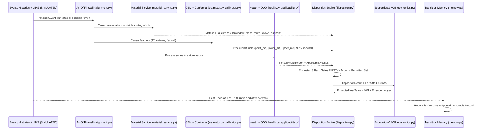

# ARCHITECTURE — GradeShift PrimePath

---

## 1. Architectural Principles

1. **Strict Separation of Domain & Presentation:**
   - All domain logic resides in [`src/gradeshift/`](../src/gradeshift/) (21 pure-Python modules).
   - Domain modules never import `streamlit` (enforced by [`tests/test_architecture.py`](../tests/test_architecture.py)).
2. **Causal Temporal Firewall (`as_of`):**
   - At any decision timestamp $t$, [`alignment.as_of`](../src/gradeshift/alignment.py) and [`replay.as_of_event`](../src/gradeshift/replay.py) strip all process observations with `timestamp > t`, lab samples with `result_at > t` (keeping pending samples with `collected_at <= t < result_at` strictly unvalued), and future routing intervals.
3. **Whole-Event Chronological Partitioning:**
   - [`partition.chronological_split`](../src/gradeshift/partition.py) partitions whole `TransitionEvent` episodes into `TRAIN` (`10` events), `CALIBRATION` (`3` events), and `LOCKED_TEST` (`5` events). No event ever spans multiple partitions.
4. **Hard Gates First, Economics Second:**
   - [`disposition.evaluate_disposition`](../src/gradeshift/disposition.py) evaluates 13 hard policy gates first. [`economics.evaluate_economics`](../src/gradeshift/economics.py) ranks only the actions permitted by the disposition engine.

---

## 2. Module Map (`src/gradeshift/`)

| Layer | Module | Responsibility |
|---|---|---|
| **Configuration & Contracts** | [`config.py`](../src/gradeshift/config.py) | Single source of truth for `GRADES` (`A`, `B`, `C`), `ECON_SCENARIOS` (`LOW`, `BASE`, `HIGH`), and `POLICY` (`policy-v1`). |
| | [`provenance.py`](../src/gradeshift/provenance.py) | `Provenance` enum (`SIMULATED`, `ASSUMPTION`, `ILLUSTRATIVE`, `MEASURED`, `PUBLICLY_VERIFIED`, `INDUSTRY_BENCHMARK`). |
| | [`schemas.py`](../src/gradeshift/schemas.py) | UTC-enforced frozen dataclasses (`ProvenancedObservation`, `LabSample`, `RoutingInterval`, `TransitionEvent`, `MaterialWindow`, `PredictionBundle`, `DecisionSnapshot`, `TransitionOutcome`, `TransitionMemoryRecord`). |
| **Simulation & Ingestion** | [`simulate.py`](../src/gradeshift/simulate.py) | Seeded CSTR/Erlang synthetic episode generator calibrated so steady state at target $H_2/M$ equals target MFI. |
| | [`ingestion.py`](../src/gradeshift/ingestion.py) | Provenance attachment and UTC timestamp normalization. |
| **Events, Firewall & Splits** | [`events.py`](../src/gradeshift/events.py) | `TransitionEvent` builder and lab latency validation (`collected_at <= result_at`). |
| | [`alignment.py`](../src/gradeshift/alignment.py) | Causal `as_of(event, t)` snapshot extraction (`AsOfSnapshot`). |
| | [`partition.py`](../src/gradeshift/partition.py) | Whole-event chronological partitioning (`TRAIN`, `CALIBRATION`, `LOCKED_TEST`). |
| | [`dataset.py`](../src/gradeshift/dataset.py) | `make_corpus`, `build_rows`, and `rows_to_xy` dataset builders. |
| **Material Identity** | [`material_identity.py`](../src/gradeshift/material_identity.py) | CSTR / Erlang residence-time kernel ($\tau = 150\text{ min}$, transport lag $25\text{ min}$) and downstream routing mass integration (`map_material`). |
| | [`material_service.py`](../src/gradeshift/material_service.py) | Operational material window resolution (`resolve_material_window`), `MaterialEligibilityResult`, `MaterialQualityLineage`, and mass conservation reconciliation. |
| **Features, Estimation & Uncertainty** | [`features.py`](../src/gradeshift/features.py) | Causal feature engineering (`37` features, `feat-v1`: lags, rolling mean/std, OLS slopes, lab state, recipe, material window stats). |
| | [`estimator.py`](../src/gradeshift/estimator.py) | `GBMQualityEstimator` (`gbm-mfi-v1`, `scikit-learn` GradientBoostingRegressor) + `LastLabBaseline`, `DeterministicProcessBaseline`, `LinearProcessBaseline`. |
| | [`calibrator.py`](../src/gradeshift/calibrator.py) | `SplitConformalCalibrator` (`split-conformal-v1`) fitted on `CALIBRATION` only, with subgroup support gating (`min_subgroup_events = 2`, `MIN_EVENTS_FOR_CONDITIONING = 5`). |
| **Health, OOD & Assurance** | [`health.py`](../src/gradeshift/health.py) | Online sensor health evaluation (`missing`, `stale`, `frozen`, `range`, `rate_of_change`, `timestamp_disorder`, `gap`). |
| | [`faults.py`](../src/gradeshift/faults.py) | Deterministic fault-injection functions (`drop_signal`, `freeze_signal`, `bias_signal`, `spike_signal`, `gap_signal`, `disorder_signal`, `stale_signal`). |
| | [`applicability.py`](../src/gradeshift/applicability.py) | Train-only `ApplicabilityDetector` checking known units, known transition directions, feature support bounds, and `IsolationForest` score. |
| | [`assurance.py`](../src/gradeshift/assurance.py) | Composite `AssuranceResult` combining prediction availability, sensor health, and applicability into a single assurance gate state. |
| **Decision & Economics** | [`disposition.py`](../src/gradeshift/disposition.py) | Pure `evaluate_disposition` engine: evaluates 13 hard policy gates first, then selects `HOLD`, `SAMPLE_NOW`, `PRIME_RELEASE_CANDIDATE`, `ABSTAIN`, or `FOLLOW_SOP`. |
| | [`economics.py`](../src/gradeshift/economics.py) | Expected loss (`ExpectedLossTable`), discrete-outcome Value of Information (`compute_voi`), episode ledger (`RealizedVsCounterfactual`), and `scale_up_annual`. |
| **Memory, Replay & Validation** | [`memory.py`](../src/gradeshift/memory.py) | Immutable `TransitionMemoryStore`, post-truth outcome reconciliation, and directional, partition-isolated top-$k$ analog retrieval (`retrieve_transition_memory`). |
| | [`replay.py`](../src/gradeshift/replay.py) | Counterfactual replay engine (`ReplayEngine`) comparing `SOP_FIXTURE`, `POINT_THRESHOLD`, `PRIMEPATH`, and `ORACLE_DIAGNOSTIC_ONLY`, plus `demo_fixture`. |
| | [`validation.py`](../src/gradeshift/validation.py) | Gate decomposition, 11-case robustness matrix, diagnostic sensitivity sweeps, economic sanity checks, evidence ladder (`E0–E5`), and claim ledger. |
| | [`pipeline.py`](../src/gradeshift/pipeline.py) | Reproducible end-to-end runners (`run_phase5` through `run_phase13`). |

---

## 3. Data & Decision Lineage Diagram

