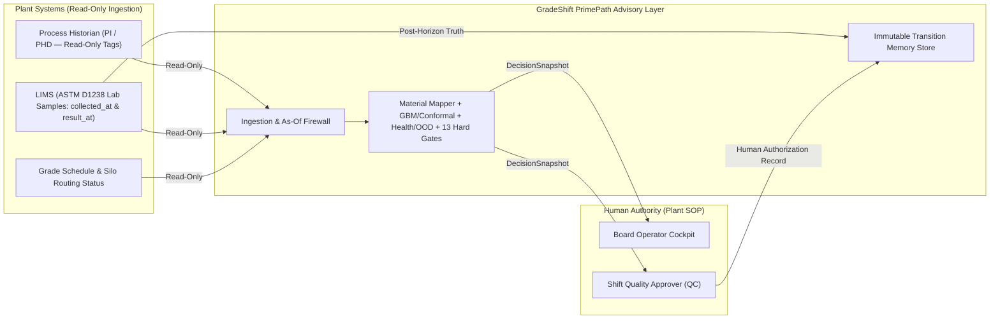

# DEPLOYMENT — GradeShift PrimePath Integration & Deployment Architecture

---

## 1. Current Prototype Deployment Mode (`E3` Ceiling)

In this repository, GradeShift PrimePath runs as a **self-contained, deterministic Python package and local Streamlit workstation** on CPU (`Python 3.10+`, `scikit-learn`, `numpy`, `scipy`, `pandas`, `plotly`, `streamlit`).

- **Zero External Infrastructure Required:** No external database, cloud API key, or GPU is required to run the test suite, regenerate validation artifacts, or launch the UI.
- **Read-Only Advisory Architecture:** The decision engine consumes immutable `TransitionEvent` snapshots and emits `DecisionSnapshot` recommendations requiring human QC authorization.

---

## 2. Target Industrial Shadow-Mode Architecture (Future Phase `E4` / `E5`)

If progressed toward an industrial pilot (e.g., at a polyolefin complex), PrimePath is designed to deploy in **read-only shadow/advisory mode** above existing plant systems:

### Key Deployment Guardrails
1. **No Write Path to DCS/APC/SIS:** PrimePath has no network or protocol path to write reactor setpoints or actuate routing valves.
2. **Unit-Specific Calibration:** Each reactor line and grade-pair direction requires its own historical event corpus (`E4`) before enabling non-abstaining recommendations for that direction.
3. **Mandatory Expiry & SOP Fallback:** Every recommendation expires after `30.0 minutes` (`recommendation_expiry_min`) and defaults to `FOLLOW_SOP`.
